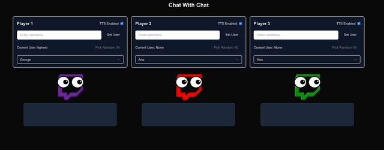

# Chat With Chat App



A Next.js application that allows Twitch chat messages to be read aloud using ElevenLabs Text-to-Speech, with support for multiple voices.

## Features

- Support for up to 3 players with individual voice settings
- ElevenLabs Text-to-Speech integration with multiple voices
- Twitch chat integration
- Random player selection from a pool of volunteers
- Modern, responsive UI built with Next.js and Tailwind CSS

## Prerequisites

- Node.js 18.17.0 or later
- A Twitch account
- An ElevenLabs account with API access

## Setup

1. Clone the repository and install dependencies:

   ```bash
   cd kcs-chat-god
   npm install
   ```

2. Create a `.env.local` file in the root directory with the following variables:

   ```
   NEXT_PUBLIC_TWITCH_CHANNEL=your_twitch_channel
   NEXT_PUBLIC_ELEVENLABS_API_KEY=your_elevenlabs_api_key
   ```

3. Get your ElevenLabs API key:

   - Create an account at https://elevenlabs.io
   - Go to your Profile Settings
   - Copy your API key

4. Start the development server:

   ```bash
   npm run dev
   ```

5. Open http://localhost:3000 in your browser

## Usage

### For Streamers

1. Open the web interface and configure up to 3 players
2. For each player, you can:
   - Manually set their username
   - Choose their voice from available ElevenLabs voices
   - Enable/disable TTS
   - Pick a random user from the pool

### For Chat Users

1. Join the player pool by typing:

   - `!player1` for Player 1
   - `!player2` for Player 2
   - `!player3` for Player 3

2. When selected as a player, your messages will be read aloud

## License

MIT License - feel free to use and modify as needed.

This is a [Next.js](https://nextjs.org) project bootstrapped with [`create-next-app`](https://nextjs.org/docs/app/api-reference/cli/create-next-app).

## Getting Started

First, run the development server:

```bash
npm run dev
# or
yarn dev
# or
pnpm dev
# or
bun dev
```

Open [http://localhost:3000](http://localhost:3000) with your browser to see the result.

You can start editing the page by modifying `app/page.tsx`. The page auto-updates as you edit the file.

This project uses [`next/font`](https://nextjs.org/docs/app/building-your-application/optimizing/fonts) to automatically optimize and load [Geist](https://vercel.com/font), a new font family for Vercel.

## Learn More

To learn more about Next.js, take a look at the following resources:

- [Next.js Documentation](https://nextjs.org/docs) - learn about Next.js features and API.
- [Learn Next.js](https://nextjs.org/learn) - an interactive Next.js tutorial.

You can check out [the Next.js GitHub repository](https://github.com/vercel/next.js) - your feedback and contributions are welcome!
